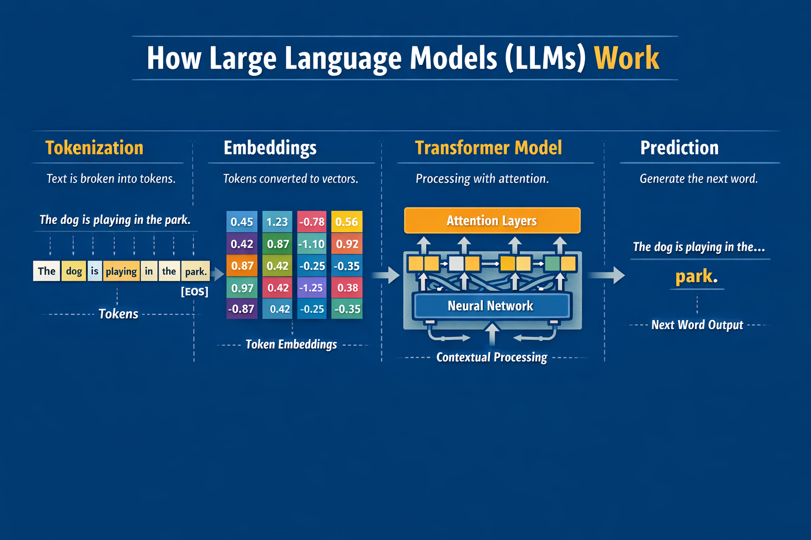

# Introduction to Large Language Models (LLMs) 

*A career-focused beginner guide to understanding Generative AI in
simple language.*


## 1. What is AI, Machine Learning, Deep Learning (Quick Foundation)

### Simple Explanation

-   **Artificial Intelligence (AI)**\
    AI is the broad idea of making machines capable of performing tasks that normally require human intelligence such as understanding language, recognizing images, or making decisions.Making machines behave intelligently (like humans making decisions).

-   **Machine Learning (ML)**\
    A subset of AI where systems **learn patterns from data** instead of being
    explicitly programmed.

-   **Deep Learning (DL)**\
    A subset of ML that uses **neural networks(brain-inspired models) with many layers** to
    learn complex patterns (images, speech, language) from huge amount of data.

### Relationship

    Artificial Intelligence
            ↓
    Machine Learning
            ↓
    Deep Learning
            ↓
    Large Language Models (LLMs)


## 2. What is a Large Language Model (LLM)?

**Definition (Simple):**\
A Large Language Model is a computer system(based on deep learning) trained on massive amounts
of text so it can **understand and generate human-like language**.

It works like an extremely advanced next-word prediction engine that has learned patterns from books, websites, and documents.

**Real-World Analogies:**

| Analogy | Explanation |
|---------|-------------|
| 🧠 Human brain | Learns from reading millions of books and conversations |
| 📚 Librarian | Finds relevant information and explains it in simple words |
| ⌨️ Autocomplete | Predicts the next best word — but at a very advanced level |

**Why LLMs Became Popular**
- Huge growth in internet data
- Powerful GPU/TPU hardware
- Breakthrough architecture called Transformers
- Ability to solve many tasks using one model (chat, coding, summarizing, translation)


## 3. How LLMs Work (High Level --- Non-Math)

LLMs are trained on huge collections of text and learn **language
patterns**.

**Training vs Inference**
| Phase | Meaning |
|-------|---------|
| Traning | Model learns patterns from billions of sentences |
| Inference | Model uses learned knowledge to answer your question |

Simple Idea
```text
Training = Studying for years
Inference = Answering exam questions
```
**Key Steps Involved Behind the scene:**
1. **Tokenization:** Break your text into smaller chunks or units(tokens).
2. **Embedding:** Converts tokens into numbers (vector).
3. **Transformer:** Uses an **attention mechanism** to decide which word matter
4. **Prediction:** Generate the next token (word/letter) based on training



**Mental Model**
```text
Huge Text Data
      ↓
Training (Transformer learns patterns)
      ↓
Prompt → Tokens → Model → Generated Answer
```

## 4. Key Components of LLM Systems

| Component         | Meaning                                |
| ----------------- | -------------------------------------- |
| Dataset           | Massive text used for training         |
| Model Training    | Learning patterns from data            |
| Embeddings        | Converting text into numerical vectors |
| Prompt            | User input / question                  |
| Output Generation | Model predicts best next tokens        |

Simple Flow:
```text
Prompt → Tokenization → Model → Output Text
```

## 5. Examples of Popular LLMs


| Model  | Company   | Real-World Use              |
| ------ | --------- | --------------------------- |
| GPT    | OpenAI    | ChatGPT, coding assistants  |
| Claude | Anthropic | Enterprise AI assistants    |
| Gemini | Google    | Search, productivity tools  |
| Llama  | Meta      | Open-source AI applications |

Used in:
- Chatbots
- Coding copilots
- Document summarization
- Enterprise automation

## 6. Key Terms You Must Know

| Term | Meaning |
|------|---------|
| Token | Small pieces of text processed by the model. More Tokens = **more cost** and **longer processing** |
| Prompt | The **instruction or input** you give to the model |
| Embeddings | Numerical representation of text meaning, used for semantic search |
| Fine-tuning | Training a base model further using **specific domain data** |
| Context Window | How much text the model can **remember** in one request |
| Hallucination | When the model generates confident but **incorrect information** |
| Temperature | Control Randomness (Low -> Factual, High -> Creative) |


## 7. Real-World Applications of LLMs

-   Customer support chatbots
-   Coding assistants (Copilot, Code assistants)
-   Content generation (blog/marketing)
-   Enterprise copilots (document analysis, workflow automation)
-   Document Summarizationf
 
## 8. LLM Limitations

- **Hallucinations:** May produce incorrect or fabricated information.
- **Bias:** Reflects and can amplify biases present in training data.
- **Outdated knowledge:** Training data can be stale and miss recent events.
- **Privacy risks:** Prompts or outputs can expose sensitive information.
- **Sensitivity to prompts:** Small changes in phrasing can cause large output differences.
- **Compute and cost:** Large models require significant computing resources and can be expensive to run.

## 8. Simple GEN AI Learning Path
```text
LLM Basics
   ↓
Prompt Engineering
   ↓
LLM APIs
   ↓
Embeddings & Vector DB
   ↓
RAG Systems
   ↓
LLM Frameworks
   ↓
Agents
   ↓
Production Systems
   ↓
Advanced GenAI

```